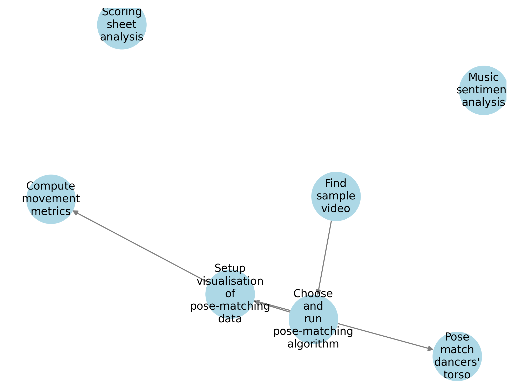

# yun.ai

---

Project tracking data `assets/project_graph.json` is turned into a graph by 

---

### Dependencies

- Need to `brew install ffmpeg`
- https://ytcutter.link/

---

### Clips

- Yulia Lipnistskaya: https://www.youtube.com/watch?v=ke0iusvydl8&t=337s&ab_channel=Olympics
    - 1'30'' - 2'00''

---

### Pose-matching

1. OpenPose (by CMU)
Pros: Very accurate, multi-person tracking, supports full-body and hand tracking.
Cons: Requires a powerful GPU, setup can be complex.
Best For: Detailed pose estimation with high accuracy.

2. MediaPipe Pose (by Google)
Pros: Easy to use, works on CPU, good accuracy.
Cons: Not as precise as OpenPose for detailed sports analysis.
Best For: Simpler sports movements, lightweight applications.

3. DeepLabCut
Pros: Highly accurate, customizable with deep learning models.
Cons: Requires training a model for best results.
Best For: Scientific and biomechanics research, tracking custom keypoints.

4. AlphaPose
Pros: High accuracy, better handling of occlusions than OpenPose.
Cons: Slower than some real-time solutions.
Best For: Sports with complex poses and fast motion.

5. MoveNet (by Google)
Pros: Fast, good accuracy, easy to use.
Cons: Slightly lower accuracy than OpenPose/AlphaPose.
Best For: Lightweight applications, fast processing.

6. BlazePose (by Google)
Pros: High accuracy for human motion, optimized for mobile and desktop.
Cons: May require fine-tuning for specific sports.
Best For: Motion analysis in fitness, yoga, and general sports.